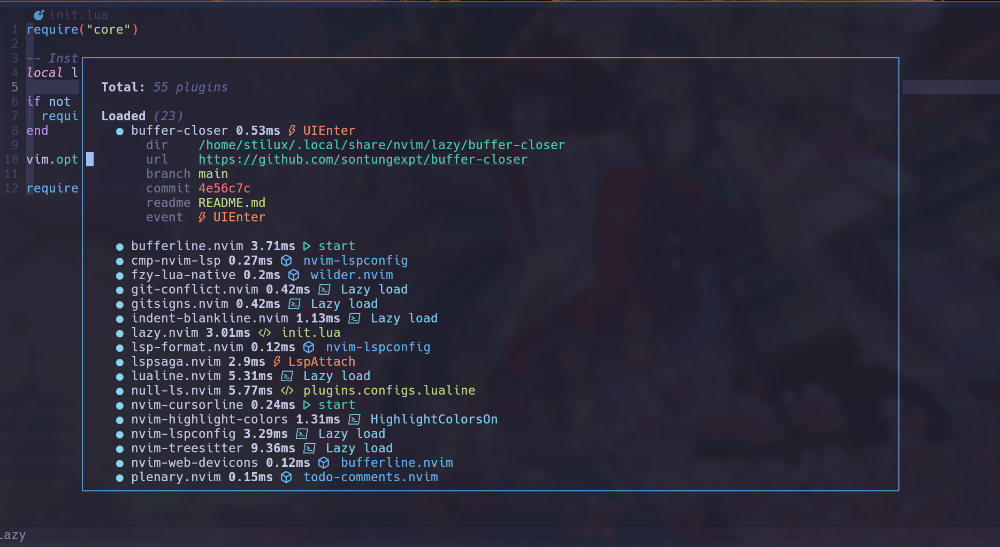
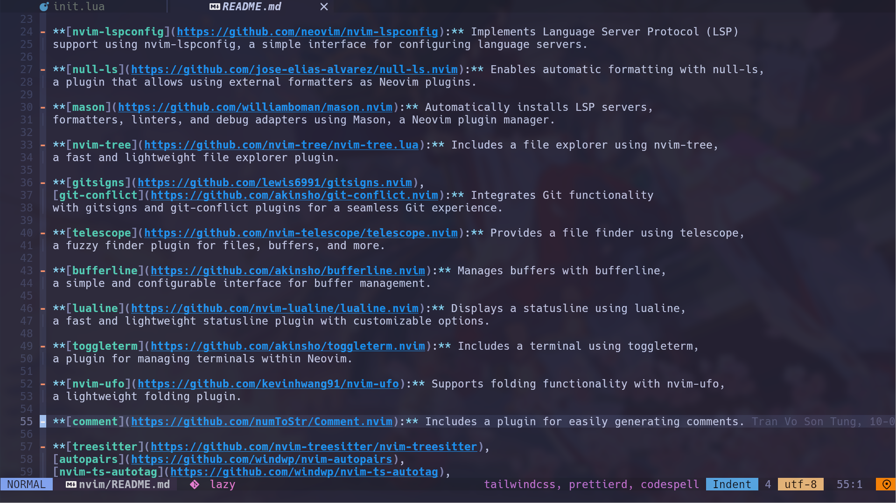

## Introduction

This plugin enables you to effortlessly open the URL under the cursor in Neovim, bypassing the need for netrw, and instead utilizing the default browser of your system.
It provides the convenience of automatically detecting and highlighting all URLs within the text content.

**NOTE:** Since I am the linux user so i only test this plugin on linux, if you
are using macos or windows and you have any problem with this plugin, please
open an issue or create a pull request to fix it

- 🚀 [Features](#features)
- 👀 [Installation](#installation)
- 💻 [Configuration](#configuration)
- 😆 [Usage](#usage)
- 😁 [Contributing](#contributing)
- ✌️ [License](#license)

<!--toc:end-->

## Features

- 🎨 Automatically detect and highlight all URLs within the text content and
  provide visual cues when hovering over clickable URLs.
- 🛠️ Allow for opening URLs from anywhere on a line, as long as the line contains only one URL.
  If one line has multiple URLs, the first URLs in the right side of cursor will be opened.
- 🎉 Open the URLs under the cursor, including the Markdown link (e.g. `https://github.com/sontungexpt/url-open`).
- ✈️ Open the GitHub page for the Neovim plugin mentioned under the cursor
  (e.g. `Plug 'nvim-lua/plenary.nvim'`, "sontungexpt/url-open").
- 🍨 Easily open the npm package specified in the package.json file. (e.g. `"lodash": "^4.17.21",`).
- 🍻 Open the Homebrew formula or cask specified in the Brewfile.
- 🍕 Open the cargo package specified in the Cargo.toml file.
- 🚀 Provide an optional deep pattern matching feature,
  which can be enabled, to accurately identify and handle various URL formats, such as:
  - http://example.com
  - https://www.example.com
  - ftp://ftp.example.com
  - file:///path/to/file.txt
  - ssh://user@hostname
  - git://github.com/user/repo
  - http://example.com/path?param=value
  - https://www.example.com/another/path#section
  - http://example.com:8080
  - https://www.example.com:8443
  - ftp://ftp.example.com:2121

## Preview





https://github.com/sontungexpt/url-open/assets/92097639/9b4fe61a-b948-470c-a1df-cd16dea706e7

https://github.com/sontungexpt/url-open/assets/92097639/c51b3e1c-8eae-48f0-a542-e16205fd00f9

## Installation

```lua
-- lazy.nvim
{
    "sontungexpt/url-open",
    event = "VeryLazy",
    cmd = "URLOpenUnderCursor",
    config = function()
        local status_ok, url_open = pcall(require, "url-open")
        if not status_ok then
            return
        end
        url_open.setup ({})
    end,
},
```

- NOTE: If you want to use minimal source with no commnets, no validate configs, no documents,
  you can use branch `mini` instead of `main` branch. Make sure you know that your config is valid

```lua
-- lazy.nvim
{
    "sontungexpt/url-open",
    branch = "mini",
    event = "VeryLazy",
    cmd = "URLOpenUnderCursor",
    config = function()
        local status_ok, url_open = pcall(require, "url-open")
        if not status_ok then
            return
        end
        url_open.setup ({})
    end,
},
```

## Configuration

You can easily add more patterns to open url under cursor by adding more patterns to `extra_patterns` config

```lua
-- default values
require("url_open").setup({
    -- default will open url with default browser of your system or you can choose your browser like this
    -- open_app = "micorsoft-edge-stable",
    -- google-chrome, firefox, micorsoft-edge-stable, opera, brave, vivaldi
    open_app = "default",
    -- If true, only open the URL when the cursor is in the middle of the URL.
    -- If false, open the next URL found from the cursor position,
    -- which means you can open a URL even when the cursor is in front of the URL or in the middle of the URL.
    open_only_when_cursor_on_url = false,
    highlight_url = {
        all_urls = {
            enabled = false,
            fg = "#21d5ff", -- "text" or "#rrggbb"
            -- fg = "text", -- text will set underline same color with text
            bg = nil, -- nil or "#rrggbb"
            underline = true,
        },
        cursor_move = {
            enabled = true,
            fg = "#199eff", -- "text" or "#rrggbb"
            -- fg = "text", -- text will set underline same color with text
            bg = nil, -- nil or "#rrggbb"
            underline = true,
        },
    },
    deep_pattern = false,
    -- a list of patterns to open url under cursor
    extra_patterns = {
        -- {
        -- 	  pattern = '["]([^%s]*)["]:%s*"[^"]*%d[%d%.]*"',
        -- 	  prefix = "https://www.npmjs.com/package/",
        -- 	  suffix = "",
        -- 	  file_patterns = { "package%.json" },
        -- 	  excluded_file_patterns = nil,
        -- 	  extra_condition = function(pattern_found)
        -- 	    return not vim.tbl_contains({ "version", "proxy" }, pattern_found)
        -- 	  end,
        -- },
		-- so the url will be https://www.npmjs.com/package/[pattern_found]


        -- {
        -- 	  pattern = '["]([^%s]*)["]:%s*"[^"]*%d[%d%.]*"',
        -- 	  prefix = "https://www.npmjs.com/package/",
        -- 	  suffix = "/issues",
        -- 	  file_patterns = { "package%.json" },
        -- 	  excluded_file_patterns = nil,
        -- 	  extra_condition = function(pattern_found)
        -- 	    return not vim.tbl_contains({ "version", "proxy" }, pattern_found)
        -- 	  end,
        -- },
		--
		-- so the url will be https://www.npmjs.com/package/[pattern_found]/issues
    },
})
```

## Usage

| **Command**                 | **Description**                           |
| --------------------------- | ----------------------------------------- |
| `:URLOpenUnderCursor`       | Open url under cursor                     |
| `:URLOpenHighlightAll`      | Highlight all url in current buffer       |
| `:URLOpenHighlightAllClear` | Clear all highlight url in current buffer |

- This plugin will not map any key by default, you can map it by yourself

```lua
vim.keymap.set("n", "gx", "<esc>:URLOpenUnderCursor<cr>")
```

## Contributing

Pull requests are welcome. For major changes, please open an issue first to discuss what you would like to change.

## License

This project is licensed under the MIT License - see the [LICENSE](LICENSE) file for details
